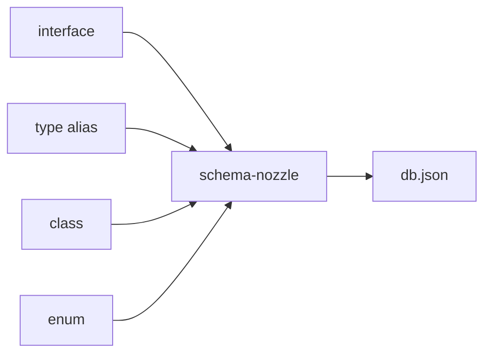

# schema-nozzle


[](https://npmcharts.com/compare/schema-nozzle) [](https://github.com/imjuni/schema-nozzle) [](https://github.com/imjuni/schema-nozzle/issues) [](https://www.npmjs.com/package/schema-nozzle) [](https://github.com/imjuni/schema-nozzle/blob/master/LICENSE)

`schema-nozzle`은 타입스크립트 `interface`, `type alias`, `class`, `enum`에서 json-schema를 생성합니다. express.js, fastify.js를 사용해서 RESTful API 서버를 개발할 때 json-schema를 작성하고, 타입도 작성하는 경험을 해보았을 것입니다. json-schema와 타입은 코드는 다르지만 의미는 동일하여 이를 모두 작성하는 것은 같은 일을 두 번하는 것과 같습니다. 그래서 [json-schema-to-ts](https://www.npmjs.com/package/json-schema-to-ts)와 같은 도구를 사용합니다. schema-nozzle는 json-schema-to-ts의 역, 타입스크립트 타입을 json-schema로 변환하는 작업을 자동화 합니다.

왜 `schema-nozzle`을 사용해야 하나요?

- 타입스크립트 타입을 json-schema로 변환합니다
- 타입스크립트 타입을 사용하기 때문에 jsdoc, typedoc와 같은 문서화 도구와 잘 어울립니다
- fastify를 사용하면 validation을 자동화 할 수 있고, swagger 문서도 자동으로 작성합니다
- 여러가지 json-schema 생성 방식을 지원합니다

`schema-nozzle`로 json-schema를 자동으로 추출하세요!

## Table of Contents

- [Table of Contents](#table-of-contents)
- [Getting Started](#getting-started)
- [Installation](#installation)
- [Usage](#usage)
- [How it works?](#how-it-works)
- [Example using fastify.js](#example-using-fastifyjs)
- [License](#license)

## Getting Started

```bash
npx schema-nozzle init
npx schema-nozzle refresh
```

init 명령어를 사용하면 `.nozzlerc` 파일과 `.nozzlefiles` 파일을 생성합니다. 이 후 refresh 명령어를 실행하면 `.nozzlefiles` 파일에 추가한 모든 `interface`, `type alias`, `class`, `enum` 파일에서 `json-schema`를 생성합니다.

어떻게 동작하는지 확인해보세요!


## Installation

```bash
# npm
npm install schema-nozzle --save-dev
```

```bash
# npm
pnpm add schema-nozzle --dev
```

## Usage

--help 옵션을 사용하면 언제든지 상세한 사용법을 확인할 수 있습니다.

```bash
# display help for each commands
npx schema-nozzle --help

# display help for add commands
npx schema-nozzle add --help

# display help for del commands
npx schema-nozzle del --help

# display help for refresh commands
npx schema-nozzle refresh --help

# display help for truncate commands
npx schema-nozzle truncate --help
```

## How it works?

schema-nozzle은 TypeScript 컴파일러 API를 사용합니다. 그래서 소스코드를 분석해서 `json-schema`를 추출해야 할 대상을 정확하게 알아냅니다.



- `schema-nozzle`은 [ts-json-schema-generator](https://github.com/vega/ts-json-schema-generator)를 사용해서 json-schema를 생성합니다
- `.nozzlefiles`은 [gitignore spec.](https://git-scm.com/docs/gitignore) 규격을 사용합니다

## Example using fastify.js

schema-nozzle을 사용하여 swagger.io 문서작성과 json-schema를 사용하여 입출력 값 검증을 처리하는 전체 예제를 [Ma-eum](https://github.com/imjuni/maeum)에서 볼 수 있습니다. DTO 타입 선언으로 swagger.io 문서작성, json-schema 작성, typedoc 문서작성을 한 번에 처리하는 예제를 참고해보세요!

## License

This software is licensed under the [MIT](https://github.com/imjuni/schema-nozzle/blob/master/LICENSE).
