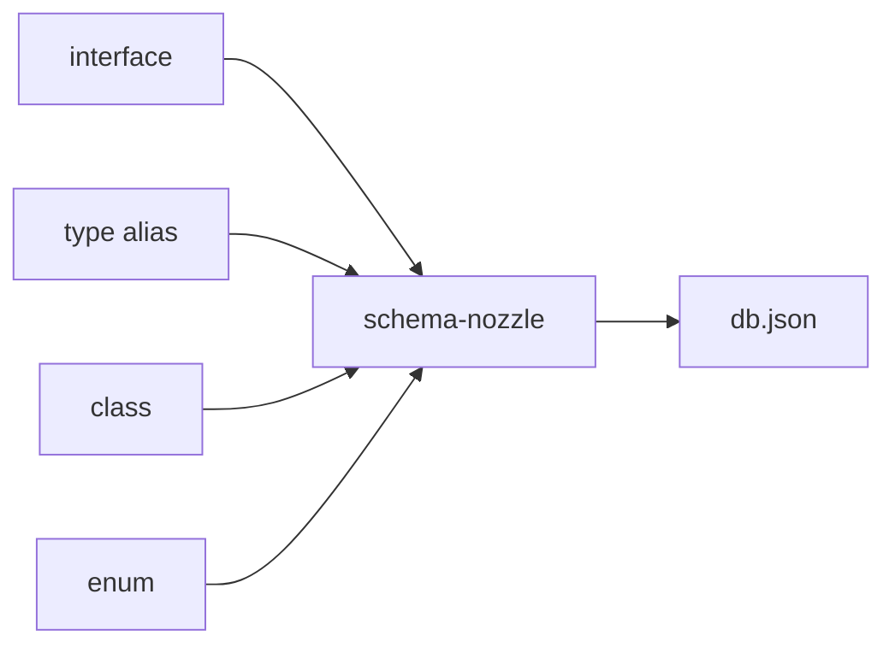

# schema-nozzle

---


[](https://npmcharts.com/compare/schema-nozzle) [](https://github.com/imjuni/schema-nozzle) [](https://github.com/imjuni/schema-nozzle/issues) [](https://www.npmjs.com/package/schema-nozzle) [](https://github.com/imjuni/schema-nozzle/blob/master/LICENSE) [](https://codecov.io/gh/imjuni/schema-nozzle)

`schema-nozzle` generates json-schema in the **TypeScript** `interface`, `type alias`, `class` and `enum`.

Why `schema-nozzle`?

- json-schema good solution for that validate request, response DTO
- share code documentation with [jsdoc](https://jsdoc.app/) or [typedoc](https://typedoc.org/)
- swagger.io documentation from json-schema using [@fastify/swagger](https://www.npmjs.com/package/@fastify/swagger), Don't need any effort!

Strict JSON data validations are need many effort. You can reduce effort using `schema-nozzle` and Feel free 🤩!

- [Getting Started](#getting-started)
- [Installation](#installation)
- [Usage](#usage)
- [How it works?](#how-it-works)
- [Example using fastify.js](#example-using-fastifyjs)
- [Roadmaps](#roadmaps)
- [License](#license)

## Getting Started

```bash
npx schema-nozzle init
npx schema-nozzle refresh
```

You can create configuration and list file using init command. And you can run refresh command, `schema-nozzle` generate `json-schema` from `interface`, `type alias`, `class` and `enum`.

You can see this mechanics!


## Installation

```bash
npm install schema-nozzle
```

## Usage

You can see help from `--help` option.

```bash
# display help for each commands
npx schema-nozzle --help

# display help for add commands
npx schema-nozzle add --help

# display help for del commands
npx schema-nozzle del --help

# display help for refresh commands
npx schema-nozzle refresh --help

# display help for truncate commands
npx schema-nozzle truncate --help
```

Also you can see detail option [here](/docs/options.md).

## How it works?

`schema-nozzle` using **TypeScript Compiler API**. So `schema-nozzle` exactly know `interface`, `type alias`, `class` and `enum`.



- `schema-nozzle` generate json-schema using [ts-json-schema-generator](https://github.com/vega/ts-json-schema-generator)
- `.nozzlefiles` file follow [gitignore spec.](https://git-scm.com/docs/gitignore)

## Example using fastify.js

A complete example of using schema-nozzle to create a swagger.io document and use json-schema to process input-output value verification can be found at [Ma-eum](https://github.com/imjuni/maeum). See the example of how DTO type declaration handles swagger.io document creation, json-schema creation, and typedoc document creation all at once!

- fastify with schema-nozzle [example](/docs/fastify.md)

## Roadmaps

- [ ] enhance init command: find varity name of tsconfig. eg. tsconfig.\*.json
- [ ] add watch command: watch `.nozzlefiles` list and add/del schema
- [ ] add more test
- [ ] tag support each schema
- [ ] load, get, set interface for schema store

## License

This software is licensed under the [MIT](https://github.com/imjuni/schema-nozzle/blob/master/LICENSE).
