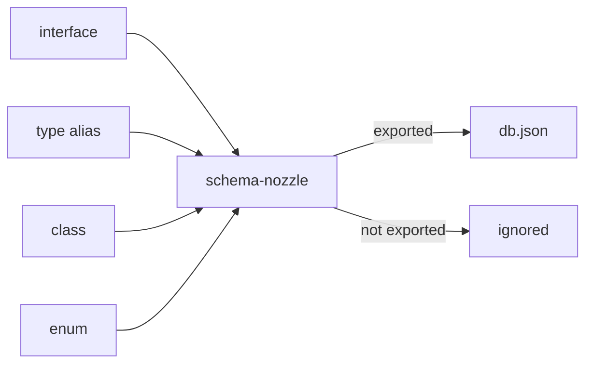
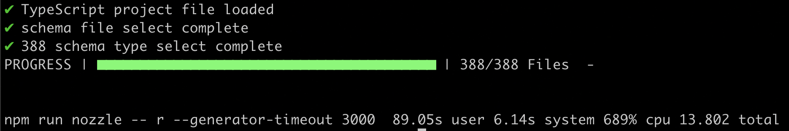

# schema-nozzle


[](https://npmcharts.com/compare/schema-nozzle) [](https://github.com/imjuni/schema-nozzle) [](https://github.com/imjuni/schema-nozzle/issues) [](https://www.npmjs.com/package/schema-nozzle) [](https://github.com/imjuni/schema-nozzle/actions/workflows/ci.yml) [](https://github.com/imjuni/schema-nozzle/blob/master/LICENSE) [](https://codecov.io/gh/imjuni/schema-nozzle) [](https://github.com/prettier/prettier)

`schema-nozzle` generates json-schema in the **TypeScript** `interface`, `type alias`, `class` and `enum`.

Why `schema-nozzle`?

- json-schema good solution for that validate request, response DTO
- share code documentation with [jsdoc](https://jsdoc.app/) or [typedoc](https://typedoc.org/)
- swagger.io documentation from json-schema using [@fastify/swagger](https://www.npmjs.com/package/@fastify/swagger), Don't need any effort!

Strict JSON data validations are need many effort. You can reduce effort using `schema-nozzle` and Feel free 🤩!

## Table of Contents <!-- omit in toc -->

- [Getting Started](#getting-started)
- [Installation](#installation)
- [How it works?](#how-it-works)
  - [TypeScript interface](#typescript-interface)
  - [json-schema](#json-schema)
- [Usage](#usage)
- [Performance](#performance)
- [Example using fastify.js](#example-using-fastifyjs)
- [Roadmaps](#roadmaps)
- [License](#license)

## Getting Started

```bash
npx schema-nozzle init
npx schema-nozzle refresh
```

You can create configuration and list file using init command. And you can run refresh command, `schema-nozzle` generate `json-schema` from `interface`, `type alias`, `class` and `enum`.

You can see this mechanics!


## Installation

```bash
npm install schema-nozzle
```

## How it works?

`schema-nozzle` using **TypeScript Compiler API**. So `schema-nozzle` exactly know `interface`, `type alias`, `class` and `enum`.



- `schema-nozzle` generate json-schema using [ts-json-schema-generator](https://github.com/vega/ts-json-schema-generator)
- `.nozzlefiles` file follow [gitignore spec.](https://git-scm.com/docs/gitignore)
- only generated exported `interface`, `type alias`, `class` and `enum`

Here is real example,

### TypeScript interface

This is input source file.

```ts
export default interface I18nDto {
  /** i18n resource id */
  id: string;

  /**
   * iso639-1 language code
   *
   * @minLength 2
   * @maxLength 5
   * */
  language: string;

  /** i18n resource content */
  content: string;

  /**
   * i18n resource use on
   *
   * @minItems 1
   * @maxItems 10
   * */
  used?: string[];
}
```

### json-schema

This is output json-schema.

```json
{
  "I18nDto": {
    "id": "I18nDto",
    "filePath": "I18nDto.ts",
    "dependency": {
      "import": {
        "name": "I18nDto",
        "from": []
      },
      "export": {
        "name": "I18nDto",
        "to": [
          "IForeginStudentDto33",
          "IForeginStudentDto",
          "IReqReadStudentQuerystring",
          "IStudentDto",
          "IProfessorDto"
        ]
      }
    },
    "schema": {
      "$id": "I18nDto",
      "$schema": "http://json-schema.org/draft-07/schema#",
      "type": "object",
      "properties": {
        "id": {
          "type": "string",
          "description": "i18n resource id"
        },
        "language": {
          "type": "string",
          "description": "iso639-1 language code",
          "minLength": 2,
          "maxLength": 5
        },
        "content": {
          "type": "string",
          "description": "i18n resource content"
        },
        "used": {
          "type": "array",
          "items": {
            "type": "string"
          },
          "description": "i18n resource use on",
          "minItems": 1,
          "maxItems": 10
        }
      },
      "required": ["id", "language", "content"],
      "additionalProperties": false
    }
  }
}
```

You can use this schema like that,

```ts
// use ajv schema store
import Ajv from 'ajv';

const ajv = new Ajv();
const db = JSON.parse((await fs.readFile('db.json')).toString());
Object.values(db).forEach((item) => ajv.addSchema(item.schema));

const validator = ajv.compile({ $ref: 'I18nDto' });
```

or

```ts
// don't use schema store
import Ajv from 'ajv';

const ajv = new Ajv();
const db = JSON.parse((await fs.readFile('db.json')).toString());
const validator = ajv.compile(db['I18nDto'].schema);
```

## Usage

You can see help from `--help` option.

```bash
# display help for each commands
npx schema-nozzle --help

# display help for add commands
npx schema-nozzle add --help

# display help for del commands
npx schema-nozzle del --help

# display help for refresh commands
npx schema-nozzle refresh --help

# display help for truncate commands
npx schema-nozzle truncate --help

# display help for watch commands
npx schema-nozzle watch --help
```

Also you can see detail option [here](/docs/options.md).

## Performance

0.19.0 version enhance performance. Now remove pain point from mass schema generation.



This image is result of 388 schema extraction using M1 macbook pro(16GB RAM, 1TB SSD, 10core). `schema-nozzle` spent only `6.14` second! 🙌 🙆

## Example using fastify.js

A complete example of using schema-nozzle to create a swagger.io document and use json-schema to process input-output value verification can be found at [Ma-eum](https://github.com/imjuni/maeum). See the example of how DTO type declaration handles swagger.io document creation, json-schema creation, and typedoc document creation all at once!

- fastify with schema-nozzle [example](/docs/fastify.md)

## Roadmaps

- [x] add watch command: watch `.nozzlefiles` list and add/del schema
- [ ] enhance init command: find varity name of tsconfig. eg. tsconfig.\*.json
- [ ] tag support each schema
- [ ] load, get, set interface for schema store
- [ ] documentation site
- [ ] $id field enhance: enclude directory path like `#/greeting/hello/world`
- [ ] add more test

## License

This software is licensed under the [MIT](https://github.com/imjuni/schema-nozzle/blob/master/LICENSE).
