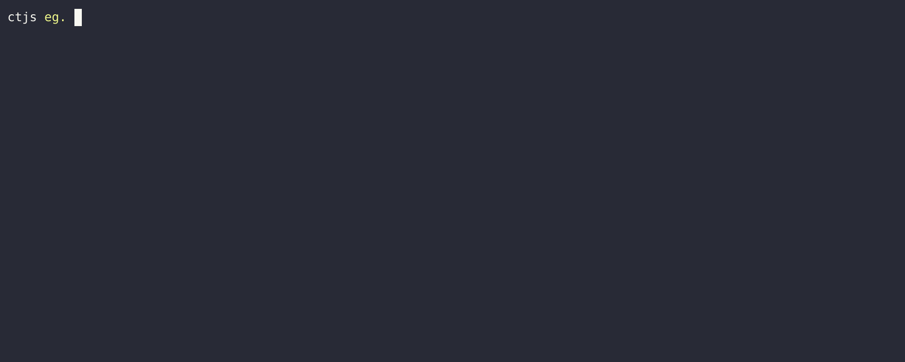

# schema-nozzle

[](https://npmcharts.com/compare/schema-nozzle?minimal=true) [](https://github.com/imjuni/schema-nozzle) [](https://github.com/imjuni/schema-nozzle/issues) [](https://www.npmjs.com/package/schema-nozzle) [](https://github.com/imjuni/schema-nozzle/blob/master/LICENSE)

automatically generate json-schema from TypeScript source code and management it!

## What is schema-nozzle?

schema-nozzle is tiny cli utility that automatically generate json-schema from TypeScript `interface` or `TypeAlias`, `class`, `enum`.

## How it works?



## installation

```bash
npm install schema-nozzle --save-dev
```

## Usage

```bash
# generate json-schema and create database (if exist)
nozzle add

# delete json-schema from database
nozzle del

# truncate database
nozzle truncate

# regenerate all json-schema in database
nozzle refresh
```

## Fastify.js

Example for fastify

```ts
import fastify from 'fastify';
import fs from 'fs';

const server = fastify();
const db = JSON.parse((await fs.promises.readFile('db.json')).toString());
Object.value(db).forEach((record) => server.addSchema(JSON.parse(record.schema)));

server.get(
  '/pokemon/:name',
  {
    schema: {
      tags: ['Pokemon'],
      summary: 'Pokemon detail information using by name',
      querystring: { $ref: 'IReqPokeDetailQuerystring' }, // You can access local reference for fastify schema store
      params: { $ref: 'IReqPokeDetailParams' }, // You can access local reference for fastify schema store
      response: {
        200: { $ref: 'IPokemonDto' }, // You can access local reference for fastify schema store
      },
    },
  },
  (req) => {
    /* your handler code */
  },
);
```

## command and option

### command

| command  | alias | description                                 |
| -------- | ----- | ------------------------------------------- |
| add      | a     | add or update json-schema to database file  |
| del      | d     | delete json-schema from database file       |
| refresh  | r     | regenerate all json-schema in database file |
| truncate | t     | reset database file                         |

### add option

| option     | alias | description                                                                     |
| ---------- | ----- | ------------------------------------------------------------------------------- |
| project    | p     | tsconfig.json path                                                              |
| config     | c     | configuration file path                                                         |
| output     | o     | database file path                                                              |
| skip-error |       | skip compile error on source file                                               |
| types      |       | TypeScript type of source code. You can use interface, type alias, enum, class. |
| files      |       | TypeScript source code file path                                                |
| format     |       | generated json-schema save format: json, string, base64                         |

### delete option

| option     | alias | description                                                                     |
| ---------- | ----- | ------------------------------------------------------------------------------- |
| project    | p     | tsconfig.json path                                                              |
| config     | c     | configuration file path                                                         |
| output     | o     | database file path                                                              |
| skip-error |       | skip compile error on source file                                               |
| types      |       | TypeScript type of source code. You can use interface, type alias, enum, class. |
| files      |       | TypeScript source code file path                                                |

### refresh option

| option     | alias | description                                             |
| ---------- | ----- | ------------------------------------------------------- |
| project    | p     | tsconfig.json path                                      |
| config     | c     | configuration file path                                 |
| output     | o     | database file path                                      |
| skip-error |       | skip compile error on source file                       |
| format     |       | generated json-schema save format: json, string, base64 |

### truncate option

| option  | alias | description             |
| ------- | ----- | ----------------------- |
| project | p     | tsconfig.json path      |
| config  | c     | configuration file path |
| output  | o     | database file path      |
