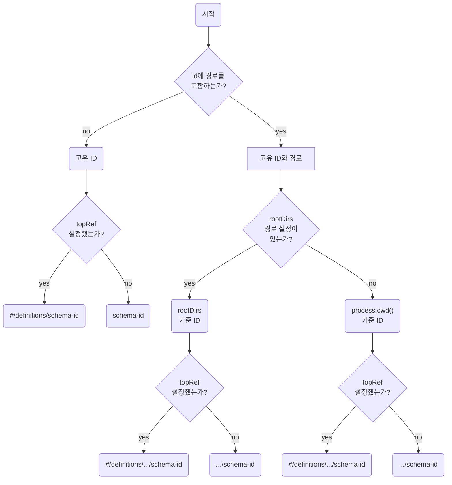

# IN_DEPTH_GUIDE_SCHEMA_ID

Schema ID에 대한 상세한 정보를 설명한다. Schema ID는 json-schema store를 사용할 때 Schema를 검색하기 위해 사용되는 것으로 몇 가지 차이점이 있다. json-schema만 사용하는 경우 json-schema store 규격에 맞춰 id를 생성하면 Ajv에서 잘 동작하지만 fastify-swagger, OpenAPI v3, v3.1에서 잘동작하는 Schema ID가 필요하면 조금 고민이 필요하다. 그래서 이 부분에 대해서 정리한다.

## Schema Store

여러 Schema를 사용한다면 Schema Store를 사용해야 한다. json-schema는 Object라서 Object Key로 여러 개의 Schema를 등록할 수 있다.

```json
{
  "Schema-A": {
    "id": "Schema-A",
    "properties": {
      "name": {
        "type": "string"
      }
    }
  },
  "Schema-B": {
    "id": "Schema-B",
    "properties": {
      "size": {
        "type": "number"
      },
      "$ref": "Schema-A"
    }
  }
}
```

또는 `definitions`를 사용할 수도 있다.

```json
{
  "definitions": {
    "Schema-A": {
      "id": "Schema-A",
      "properties": {
        "name": {
          "type": "string"
        }
      }
    },
  },
  "Schema-B": {
    "id": "Schema-B",
    "properties": {
      "size": {
        "type": "number"
      },
      "$ref": "#/defnitions/Schema-A"
    }
  }
}
```

`definitions`는 Schema를 별도로 모아두는 저장소 역할을 한다. json-schema를 정의하는 Object 내에 참조를 위해서 Schema를 모아두는 것으로 보면 된다. 물론 1depth key를 사용하지 않고 `definitions`만 사용하는 것도 가능하다.

```json
{
  "definitions": {
    "Schema-A": {
      "id": "Schema-A",
      "properties": {
        "name": {
          "type": "string"
        }
      }
    },
    "Schema-B": {
      "id": "Schema-B",
      "properties": {
        "size": {
          "type": "number"
        },
        "$ref": "#/defnitions/Schema-A"
      }
    }
  }
}
```

## Problem

앞선 설명에서와 같이 schema-id가 경로를 가지지 않으면 어떤 문제도 생기지 않는다. @fastify/swagger를 사용해서 OpenAPI v2, v3로 잘 변환된다. 하지만 다음과 같은 경우가 있을 수 있다.

```ts
// device/IPhone.ts
interface IPhone {
  weight: number;
  model: string;
  assembledAt: Date;
}
```

```ts
// config/IPhone.ts
interface IPhone {
  brightness: number;
  contrast: number;
}
```

디바이스 정보를 저장하는 `IPhone`과 실제 사용자가 설정을 저장하는 `IPhone` 두 가지를 한 번에 다뤄야 할 수 있다. MSA 아키텍처에서 여러 플랫폼을 사용해서 iOS, Android 클라이언트에 데이터를 전달하는 BFF API에서 자주 만날 수 있는 상황이다.

문제는 이런 상황을 OpenAPI v2에서는 처리가 불가능하며, 아직까지 @fastify/swagger에서도 처리가 불가능하다. 하지만 json-schema store, OpenAPI v3에서는 처리가 가능하다. 그래서 Schema-Nozzle에서 Schema ID를 어떻게 다룰 것인지에 대한 전략이 필요하다.

## Flow



## Solution

즉, 사용자 의지에 따라 v2, v3 등 어떤 방식으로 Schema ID를 다룰 것인지에 대해 조절할 수 있어야 한다.
